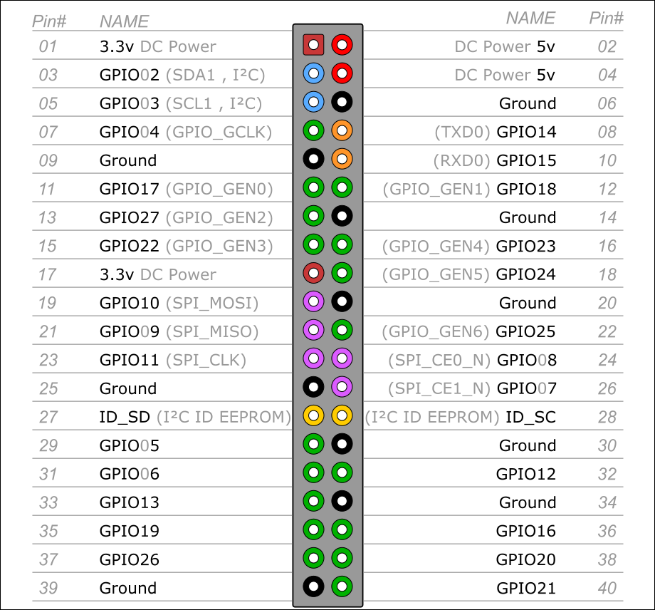

# GPIO-hub-controller
A script who managing the GPIO output port of any raspberry pi using Pi.GPIO, different uses are possible: leds, fans, etc.

## 1 - Required

* Any raspberry pi (first generation with 26 pins / last generation with 40 pins).

* Something to plug on the GPIO port: a led or a fan.

* The RPi.GPIO librarie (original integrated in raspbian).

## 2 - Installation (The schema is as follows)

* Clone the repositorie : https://github.com/p3titcr0c0/GPIO-hub-controller.git

* Run the script with Python3 on your raspberry:
```bash
$ python3 main.py
```

## 3 - Usage

* Manual screenshot : (FR)
#  

## 4 - Exemple

## 5 - types of GPIO

* Last generation (40 pins) :



* First generation (26 pins) :
#  
